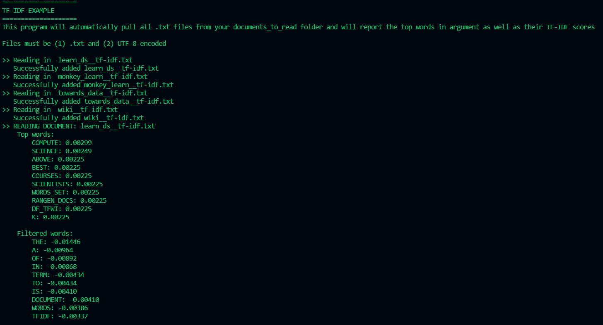
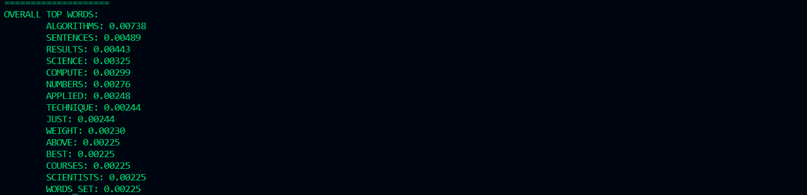

# Algorithm Practise: TF-IDF

## What is TF-IDF?

**TF-IDF (Term Frequency, Inverse Document Frequency)** is an algorithm that ascribes importance to words in a document based on their frequency across multiple documents.

If a word appears frequently in a document, it's important (eg. 'python' showing up multiple times in a data science article) and should be given a high score **BUT** if that word appears a ton in many documents, it is not a "unique identifier" (eg. 'and'/'the' showing up a bunch across several articles) and should be given a low score.

## Why Program it?

When I tutor students, this algorithm pops up quite a bit, so it'd be helpful to have an example program on hand.

## How this program works:

This is a CLI application, so you'll have to clone the repository and run it from your computer.

The program is set up to automatically read in all the text files from the `documents_to_read` folder and present you with the top TF-IDF for each document and then the overall most interesting topics.

Note: This implementation of TF-IDF is purposefully basic: It's mostly meant for showing students how TF-IDF works.